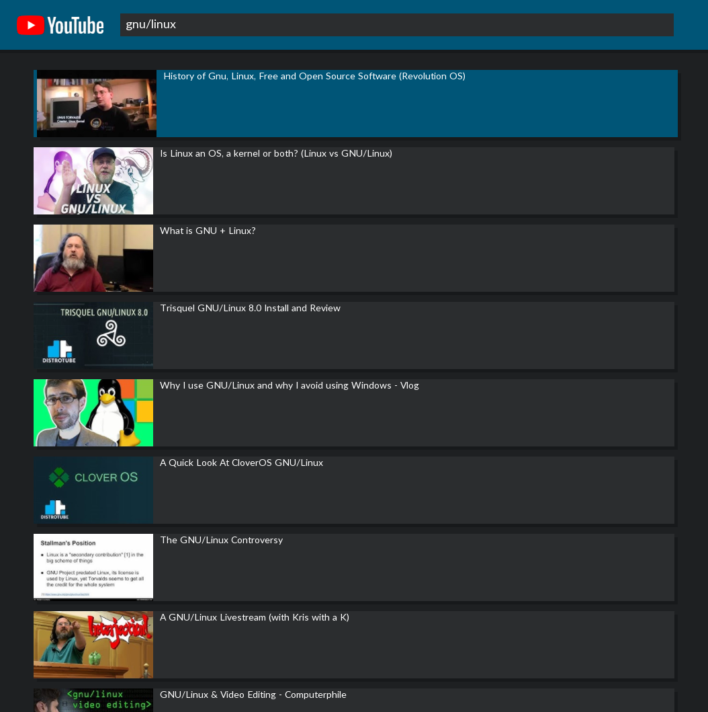

# QuickMedia
Native clients of websites with fast access to what you want to see. [Old video demo with manga](https://beta.lbry.tv/quickmedia_manga-2019-08-05_21.20.46/7).\
Currently supported websites: `youtube`, `manganelo` and _others_.\
Here is an example with YouTube:\
\
Config data, including manga progress is stored under `$HOME/.config/quickmedia`
## Controls
Press `ESC` to go back to the previous menu.\
Press `Ctrl + T` when hovering over a manga chapter to start tracking manga after that chapter. This only works if AutoMedia is installed and
accessible in PATH environment variable.
## Video controls
Press `space` to pause/unpause video. `Double-click` video to fullscreen or leave fullscreen.
# Dependencies
## Compile
See project.conf \[dependencies].
## Runtime
### Required
`curl` is required for network requests.
### Optional
`mpv` is required for playing videos. This is not required if you dont plan on playing videos.\
`youtube-dl` needs to be installed to play videos from youtube.\
`notify-send` needs to be installed to show notifications (on Linux and other systems that uses d-bus notification system).
# TODO
If a search returns no results, then "No results found for ..." should be shown and navigation should go back to searching with suggestions.\
Give user the option to start where they left off or from the start or from the start.\
For manga, view the next chapter when reaching the end of a chapter.\
Search is asynchronous, but download of image also needs to be asynchronous, also add loading animation.\
Retain search text when navigating back.\
Disable ytdl_hook subtitles. If a video has subtitles for many languages, then it will stall video playback for several seconds
until all subtitles have been downloaded and loaded.
Add grid-view when thumbnails are visible.\
Add scrollbar.\
Add option to scale image to window size.\
The search should wait until there are search results before clearing the search field and selecting the search suggestion.\
Somehow deal with youtube banning ip when searching too often.\
Optimize shadow rendering for items (Right now they fill too much space that is behind items). It should also be a blurry shadow.